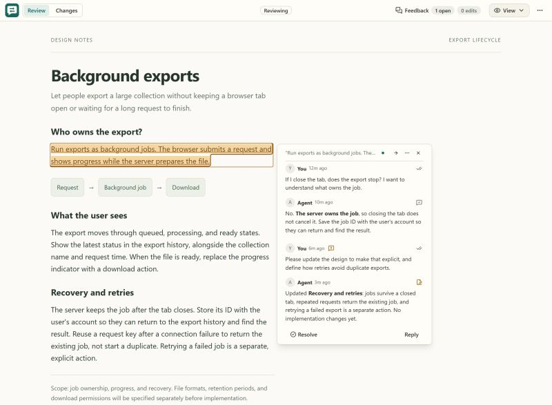

Working through designs and documentation is part of developing software with agents. Before moving into implementation, I want to understand the proposed approach and discuss the important decisions. That often means going back over a document, asking about a particular part, and revising it together.

Doing that through chat felt awkward. I kept having to describe which paragraph I meant or copy text back into the conversation. I wanted something like reviewing a Google Doc together, but with the review running locally and my agent responding to the comments and making the changes we discussed.

I've been extending Doc Review around that interaction. It opens a Markdown document, HTML file, or local web page in the browser. Highlight a passage, ask a question or request a change, and send the feedback to the agent. You can also edit the content directly. The agent replies to the comments, and you can compare the revisions and keep going.

The latest version keeps those conversations attached to the relevant passages and makes the replies and changes easier to follow. Questions and requests for changes are separate, so asking about a design decision does not tell the agent to start changing it.

Link: [https://github.com/erdemtuna/doc-review](https://github.com/erdemtuna/doc-review)

