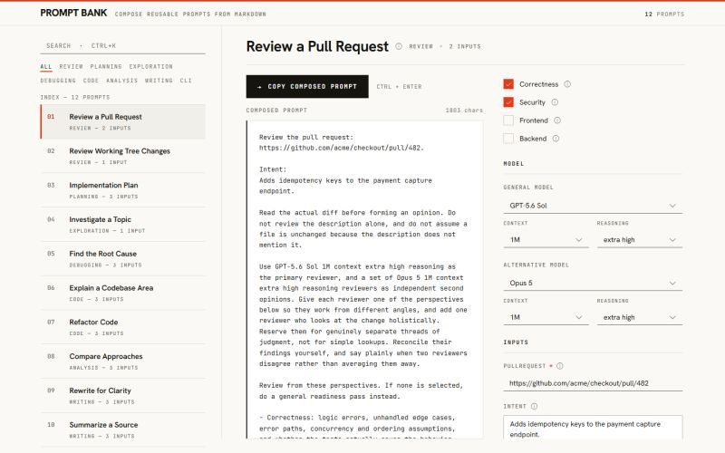

I had been keeping my most used prompts in local files and a notebook. Over time, I noticed I was not really writing new prompts. I was reusing the same few and editing the same parts of them each time.

So, I made those parts explicit. In Prompt Bank, a prompt is a Markdown file that declares the parts that change as variables, and the parts you only sometimes want as optional sections. The app reads the file and gives you a form: fill in the variables, toggle the sections you want, check the composed text, copy it into whatever tool you use.

Link: [https://github.com/erdemtuna/prompt-bank](https://github.com/erdemtuna/prompt-bank)

They stay ordinary files, so where they live is up to you. You can keep a personal set of your own, and any project you open can carry its own, so a team can share the same prompts.

Cross-platform desktop app built with Tauri and React.

The shape of it came out of conversations with [Rob Emanuele](https://www.linkedin.com/in/rob-emanuele-15852912) and [Juan Manuel Castro](https://es.linkedin.com/in/jumacabo).

