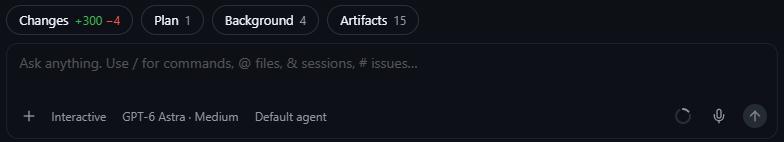
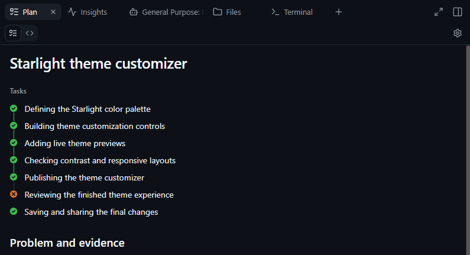
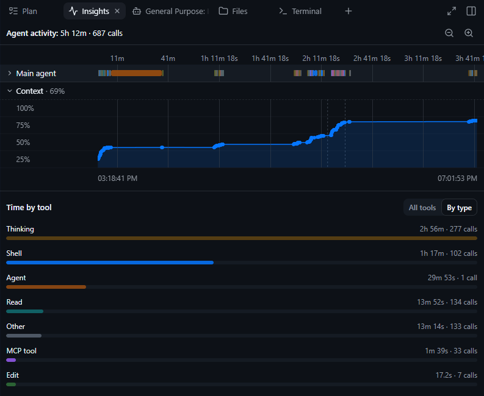
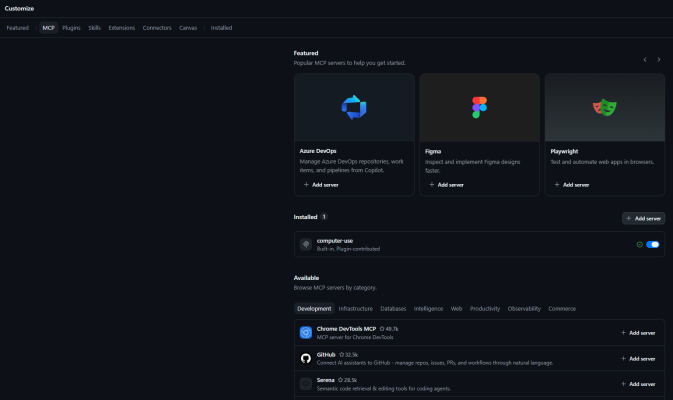

After several months of using [Copilot CLI](https://github.com/features/copilot/cli), I started using the [GitHub Copilot app](https://github.com/features/ai/github-app). What stood out to me was how it presented the work: sessions associated with a repository, subsessions, artifacts, and changes across files. It felt like returning to my days of working in an IDE.

With Copilot CLI, following the work through text made it difficult for me to understand what was happening in my codebase. The GitHub Copilot app still abstracts what the agent does, but I find that abstraction easier to inspect and explore. That difference has become the main reason I prefer using it.

## Following the work

What I appreciate most in the GitHub Copilot app is how file changes and artifacts surface in the context of a session.

<figure>



<figcaption>Changes, plans, and background activity are accessible alongside the conversation.</figcaption>
</figure>

Seeing which files a session has changed gives me a sense of its scope. I can open a particular change and then return to the list of changed files. That is a different way of following the session from reading its progress updates in order: I can choose where to look based on the changes themselves.

A session is supported by different views of the work, including its plan, insights, files, and terminal. I can choose the view that fits what I want to inspect rather than approach everything through the conversation.

<figure>



<figcaption>The plan is open here; the surrounding views provide other ways to explore the same session.</figcaption>
</figure>

This makes the work more accessible to me. I can move between those views, the conversation, and the activity in a subsession. When I want to use VS Code or another tool, I can open it from the session and continue with the files there. Insights is a nice additional view rather than a main reason for my preference. It offers a breakdown of session activity, including time spent across tools.

<figure>



<figcaption>Insights offers an additional breakdown of activity within a session.</figcaption>
</figure>

### Where I start those sessions

Those sessions often need context from more than one Git repository. To work across them, I've adopted a "meta repository": a parent repository containing the related repositories as Git submodules.

For an application with a frontend, backend, and background worker, the structure could look like this:

```text
project-workspace\       <- meta repository; start the agent here
|-- frontend\            <- Git submodule: user interface
|-- backend\             <- Git submodule: API
|-- worker\              <- Git submodule: background processing
```

A single change may require coordinated edits across the frontend, backend, and worker. Starting the agent from the parent repository gives it access to the related codebases while each repository retains its own history.

This way of organizing the working context works with Copilot CLI too. In the GitHub Copilot app, I point to that repository location and start sessions from the project. I can return there to continue work or start another session. When a session delegates parts of a task, I can see the subsessions, understand how they relate to the main one, and follow what is happening in them.

## Making sense of my setup

<figure>



<figcaption>The Customize area brings capability discovery and management into one place, from MCP servers and skills to installed customizations.</figcaption>
</figure>

Tools and customizations have accumulated around my sessions over time. The GitHub Copilot app's [Customize area](https://docs.github.com/en/copilot/how-tos/github-copilot-app/customize-github-copilot-app) includes MCP servers for connecting the agent to tools and data, skills for reusable instructions and resources, and plugins that package capabilities together. I use this area less often, but it gives me a place to revisit what is installed and explore what else might be useful. I can make sense of my existing setup as well as discover new capabilities.

## Beyond this particular tool

Users of other agentic coding tools also have a choice between terminal and graphical interfaces. [Claude Code](https://code.claude.com/docs/en/overview) has terminal and graphical interfaces, including the Code tab in the Claude desktop app. [OpenCode](https://opencode.ai/docs/) offers terminal and desktop interfaces. [Cursor](https://cursor.com/docs) has its graphical editor and a terminal CLI.

## Looking into why this felt different

After months with Copilot CLI, using the GitHub Copilot app made me curious about why the more visual experience felt easier to understand. Reading an individual update was not the difficult part. It was forming an overall picture from those updates: how the changes related to one another and where they fitted into the work. Visual support alongside the conversation felt more natural to me, so I looked into research on how text and visuals contribute to understanding.

The familiar saying "a picture is worth a thousand words" captures some of that intuition. A written explanation can describe the parts of a system, while a visual representation can make their relationships apparent. Together, they can help a reader understand how those parts fit and work together.

I found a concrete example of this in **Butcher \[1\]**. In two experiments on learning about the heart and circulatory system, diagrams alongside text helped learners build a more accurate understanding of the system. Simplified diagrams that highlighted important structural relationships were particularly helpful for connecting information. **Ainsworth \[2\]** develops the broader idea that different representations can complement one another and clarify interpretation. Their relationship matters: if the reader cannot connect them, an additional representation can make understanding harder rather than easier.

This reading aligned with my existing preference for visual support alongside text. In the GitHub Copilot app, that preference extends to visual interaction: seeing the work laid out, opening a change, exploring a subsession, and moving between views. Much of what I read is still text, but I can explore the structure around it to understand the work better. The app still abstracts the work, but that combination suits me better.

## References

1. Butcher, K. R. (2006). _Learning from text with diagrams: Promoting mental model development and inference generation_. Journal of Educational Psychology, 98(1), 182–197. [DOI](https://doi.org/10.1037/0022-0663.98.1.182).
2. Ainsworth, S. (2006). _DeFT: A conceptual framework for considering learning with multiple representations_. Learning and Instruction, 16(3), 183–198. [DOI](https://doi.org/10.1016/j.learninstruc.2006.03.001).
